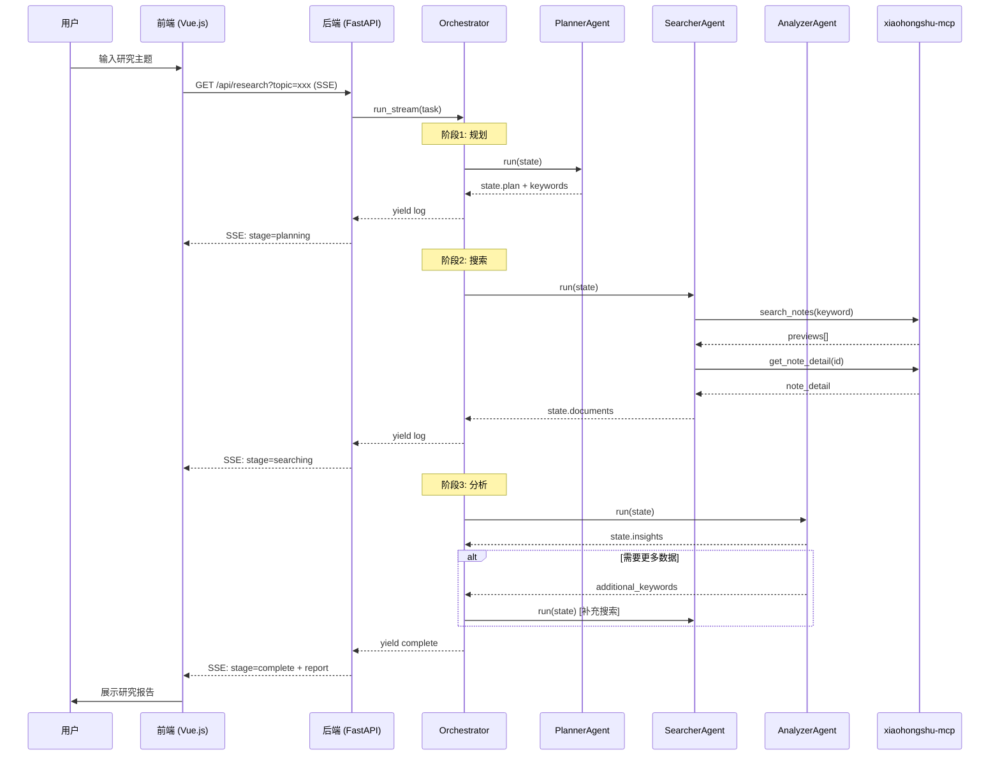

# RedNote Research Agent 架构分析报告

> **分析时间**: 2025-12-31  
> **使用 Pattern**: SYNTHESIZED (融合自 summarize + analyze_prose + extract_wisdom)  
> **分析模式**: Fabric Agent 智能分析工作流 v2.1

---

## 一句话总结

RedNote Research Agent 是一个基于 MCP 协议的多 Agent 研究系统，采用 Planner→Searcher→Analyzer 流水线架构实现小红书内容自动化研究与报告生成。

---

## 核心洞察

### 1. 架构设计评估

#### 1.1 整体架构

```
┌─────────────────────────────────────────────────────────────────┐
│                     RedNote Research Agent                       │
├─────────────────────────────────────────────────────────────────┤
│  前端层 (Vue.js + Pinia)                                         │
│  ├── HomeView (研究入口)                                          │
│  ├── ResearchView (SSE 实时进度)                                  │
│  ├── ReportView (报告展示)                                        │
│  └── PublishEditView (发布编辑)                                   │
├─────────────────────────────────────────────────────────────────┤
│  后端层 (FastAPI)                                                │
│  ├── SSE 流式研究端点 (/api/research)                             │
│  ├── 历史记录 API (/api/history)                                  │
│  ├── MCP 代理 API (/api/mcp)                                      │
│  └── 发布服务 API (/api/publish)                                  │
├─────────────────────────────────────────────────────────────────┤
│  Agent 层 (Multi-Agent Orchestration)                            │
│  ├── PlannerAgent (任务规划)                                      │
│  ├── SearcherAgent (数据采集)                                     │
│  ├── AnalyzerAgent (内容分析)                                     │
│  └── ImageValidatorAgent (图片验证)                               │
├─────────────────────────────────────────────────────────────────┤
│  服务层 (Business Logic)                                         │
│  ├── HistoryService (历史记录)                                    │
│  ├── PublisherService (发布服务)                                  │
│  ├── ImageGeneratorService (图片生成)                             │
│  └── SettingsService (配置管理)                                   │
├─────────────────────────────────────────────────────────────────┤
│  外部依赖                                                         │
│  ├── xiaohongshu-mcp (小红书数据获取)                              │
│  ├── OpenAI Compatible LLM (文本生成)                             │
│  └── VLM/ImageGen API (图片处理)                                  │
└─────────────────────────────────────────────────────────────────┘
```

#### 1.2 架构优势

| 维度 | 评分 | 分析 |
|------|------|------|
| **模块化程度** | ⭐⭐⭐⭐☆ | Agent、Service、Web 分层清晰，职责单一 |
| **可扩展性** | ⭐⭐⭐⭐☆ | 新增 Agent 只需继承 BaseAgent，接口标准化 |
| **状态管理** | ⭐⭐⭐☆☆ | 使用 Pydantic 的 [ResearchState](file:///e:/code/workspace/1230/rednote-research-agent/rednote_research/state.py#58-95)，但前后端状态同步依赖手动 |
| **错误处理** | ⭐⭐⭐⭐☆ | LLM 调用有指数退避重试机制，搜索有 3 次重试 |
| **可观察性** | ⭐⭐⭐☆☆ | 日志级别齐全，但缺乏分布式追踪和 Metrics |

#### 1.3 与业界框架对比

| 特性 | RedNote Agent | LangGraph | CrewAI |
|------|---------------|-----------|--------|
| **状态管理** | Pydantic State | 内置 State Graph | 任务驱动 |
| **Agent 协作** | 线性流水线 | DAG/循环 | 角色协作 |
| **持久化** | JSON 文件 | 可选 Checkpointing | 内存为主 |
| **流式输出** | 原生 SSE | AsyncIterator | Callback |
| **MCP 集成** | ✅ 原生支持 | ❌ 需自定义 | ❌ 需自定义 |
| **生产就绪** | ⭐⭐⭐ | ⭐⭐⭐⭐⭐ | ⭐⭐⭐⭐ |

---

### 2. 数据流逻辑分析

#### 2.1 核心研究数据流



#### 2.2 状态对象详解

后端 [ResearchState](file:///e:/code/workspace/1230/rednote-research-agent/rednote_research/state.py#58-95) (Pydantic):
```python
class ResearchState:
    task: str                    # 用户原始任务
    plan: ResearchPlan           # 规划结果
    search_keywords: list[str]   # 主关键词
    additional_keywords: list    # 反思补充关键词
    documents: list[NoteData]    # 收集的笔记
    insights: dict               # 分析洞察
    image_analyses: dict         # 图片分析结果
    is_complete: bool            # 完成标志
    iteration_count: int         # 反思迭代计数
```

前端 `useResearchStore` (Pinia):
```typescript
interface ResearchStore {
    id: string | null
    topic: string
    outline: OutlineSection[]
    notes: ResearchNote[]
    summary: string
    keyFindings: string[]
    isCompleted: boolean
    currentDraftId: string | null
}
```

> [!WARNING]
> **数据同步问题**: 前后端状态模型不完全对齐，`insights` 到 `keyFindings` 的转换在 SSE 事件处理中手动完成，容易导致数据不一致。

---

### 3. 前后端协作关系

#### 3.1 通信机制

| 通信类型 | 技术方案 | 使用场景 |
|----------|----------|----------|
| **实时流式** | SSE (Server-Sent Events) | 研究进度推送、日志流 |
| **REST API** | HTTP GET/POST | 历史记录、设置、发布 |
| **状态同步** | 手动解析 SSE 事件 | `stage`/`stats`/`complete` 事件 |

#### 3.2 SSE 事件类型

```json
// 日志事件
{"type": "log", "level": "info", "message": "开始规划研究任务..."}

// 阶段切换事件
{"type": "stage", "stage": "searching", "progress": 0.3}

// 统计更新事件
{"type": "stats", "notes_count": 10, "keywords_processed": 3}

// 完成事件
{"type": "complete", "report": {...}, "id": "uuid"}
```

#### 3.3 协作痛点

1. **单文件后端**: [app.py](file:///e:/code/workspace/1230/rednote-research-agent/rednote_research/web/app.py) 达到 47KB (~1200行)，职责过重
2. **前端状态复原**: 页面刷新后需重新从 `/api/history/{id}/full` 加载
3. **错误边界缺失**: SSE 断连后无自动重连机制

---

### 4. 易用性评估

#### 4.1 用户体验亮点

- ✅ **一键研究**: 输入主题即可获得完整报告
- ✅ **实时进度**: SSE 流式日志，用户感知清晰
- ✅ **扫码登录**: 设置页直接扫码，无需手动配置 Cookie
- ✅ **Docker 一键部署**: `docker compose up -d` 即可运行

#### 4.2 易用性问题

| 问题 | 严重度 | 描述 |
|------|--------|------|
| 配置复杂 | 🟡 中 | 需要配置多个 API Key (LLM/VLM/ImageGen) |
| 登录过期无感知 | 🔴 高 | MCP 登录失效后搜索静默失败 |
| 报告编辑困难 | 🟡 中 | 大纲调整需手动拖拽，无批量操作 |
| 历史恢复脆弱 | 🔴 高 | 刷新页面后可能丢失 Store 状态 |

---

### 5. 产品效果优化方向

#### 5.1 研究质量

| 当前状态 | 问题 | 优化建议 |
|----------|------|----------|
| 关键词生成 | 依赖单次 LLM 输出 | 增加关键词扩展 Agent |
| 笔记筛选 | 按点赞数排序 | 加入 LLM 相关性打分 |
| 反思循环 | 最多 3 次迭代 | 动态判断信息覆盖度 |

#### 5.2 报告生成

| 当前状态 | 问题 | 优化建议 |
|----------|------|----------|
| 图片分配 | 关键词匹配 | 增加语义嵌入相似度 |
| 章节生成 | 单次 LLM 调用 | 分段生成 + 连贯性检查 |
| 封面图 | 外部 API 生成 | 支持多风格模板 |

---

## 短期优化规划 (1-2 周)

### P0 - 紧急修复

1. **[前端] SSE 断连重连机制**
   - 文件: [frontend/src/views/ResearchView.vue](file:///e:/code/workspace/1230/rednote-research-agent/rednote_research/frontend/src/views/ResearchView.vue)
   - 实现: EventSource 断开后自动重连 + 状态恢复

2. **[后端] 登录状态主动检测**
   - 文件: [web/app.py](file:///e:/code/workspace/1230/rednote-research-agent/rednote_research/web/app.py) - [mcp_login_status](file:///e:/code/workspace/1230/rednote-research-agent/rednote_research/web/app.py#629-643)
   - 实现: 研究开始前调用检测，失效则提示重新登录

3. **[前端] Store 持久化**
   - 文件: [frontend/src/stores/research.ts](file:///e:/code/workspace/1230/rednote-research-agent/rednote_research/frontend/src/stores/research.ts)
   - 实现: 使用 `pinia-plugin-persistedstate` 或 localStorage

### P1 - 架构优化

4. **[后端] app.py 拆分**
   - 目标: 按功能拆分为 `routes/research.py`, `routes/history.py` 等
   - 预计: 单文件 \< 300 行

5. **[数据] 前后端状态对齐**
   - 统一 [ResearchState](file:///e:/code/workspace/1230/rednote-research-agent/rednote_research/state.py#58-95) 和 `ResearchStore` 的字段命名
   - 增加 TypeScript 类型生成脚本

### P2 - 体验增强

6. **研究进度可视化**
   - 增加进度条和阶段指示器
   - 显示预计剩余时间

7. **历史记录增强**
   - 增加标签筛选和全文搜索
   - 支持批量删除

---

## 长期优化规划 (1-3 月)

### 架构升级

```
┌─────────────────────────────────────────────────────────────────┐
│                      Architecture v2.0                          │
├─────────────────────────────────────────────────────────────────┤
│  • 引入 LangGraph 作为 Agent 编排层                              │
│  • 支持 DAG 工作流和 Checkpoint 持久化                            │
│  • 添加反思 Agent (Reflective Agent)                             │
├─────────────────────────────────────────────────────────────────┤
│  • 后端迁移到 SQLite/PostgreSQL                                  │
│  • 支持多用户隔离                                                 │
│  • 引入 Redis 作为任务队列 (Celery)                               │
├─────────────────────────────────────────────────────────────────┤
│  • 前端引入 TanStack Query (React Query 理念)                    │
│  • 优化大列表虚拟滚动                                             │
│  • PWA 离线支持                                                  │
└─────────────────────────────────────────────────────────────────┘
```

### 功能扩展

1. **多平台支持**
   - 接入抖音、微博等平台 MCP
   - 统一数据模型和搜索接口

2. **协作研究**
   - 多人协作编辑报告
   - 评论和版本历史

3. **AI 增强**
   - 自定义 Agent Prompt
   - Agent 行为可视化调试
   - 支持 RAG 知识库

4. **企业级特性**
   - OAuth 登录
   - 团队空间和权限管理
   - API Rate Limiting
   - 审计日志

---

## 验证检查清单

- [x] 第一阶段的分析是否全面且准确？ ✅ 涵盖架构、数据流、协作、易用性
- [x] 第二阶段的优化建议是否可落地？ ✅ 明确文件和实现方向
- [x] 过程日志是否完整记录？ ✅ 见 `fabric_process_log.md`
- [x] 用户是否清楚下一步行动？ ✅ P0-P2 优先级明确

---

## 附录：参考资源

### 业界对比搜索结果

1. [Best Practices for AI Agent Implementations](https://onereach.ai/blog/best-practices-for-ai-agent-implementations/) - Gartner 预测和 MCP 标准
2. [LangGraph vs CrewAI](https://www.zenml.io/blog/langgraph-vs-crewai) - 框架功能对比
3. [SSE for LLM Streaming](https://akanuragkumar.medium.com/streaming-ai-agents-responses-with-server-sent-events-sse) - FastAPI + Redis + Celery 架构
