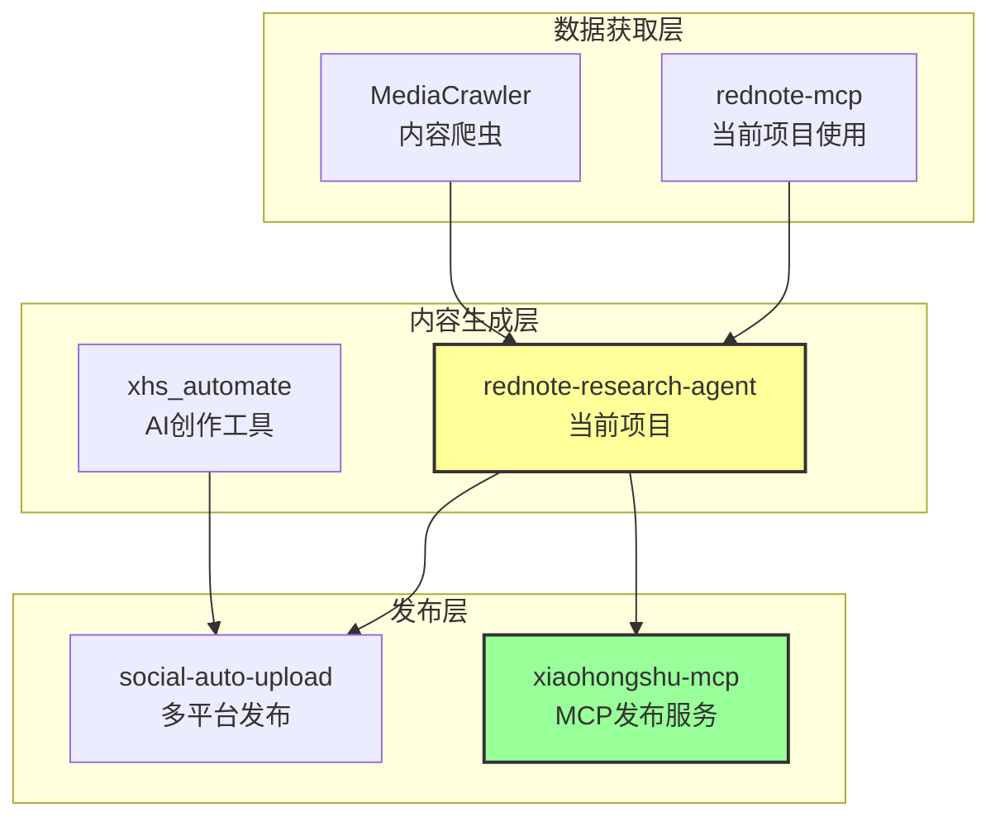
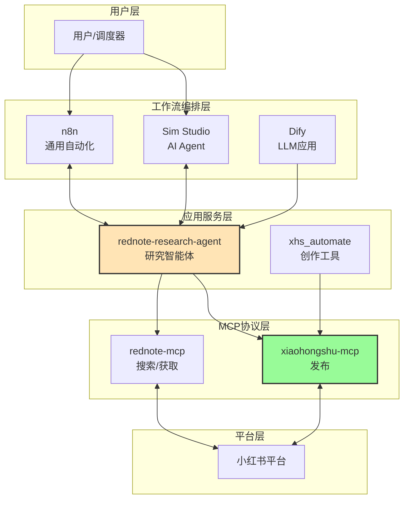
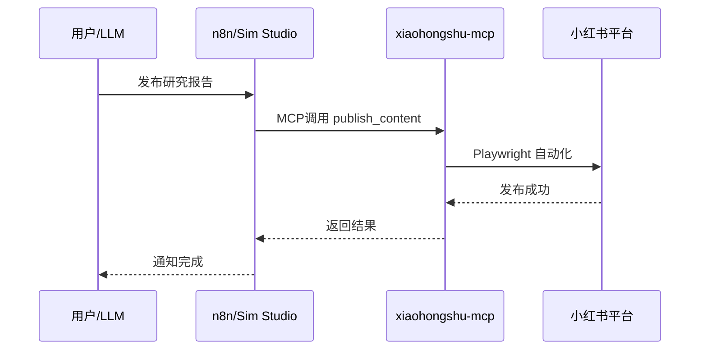
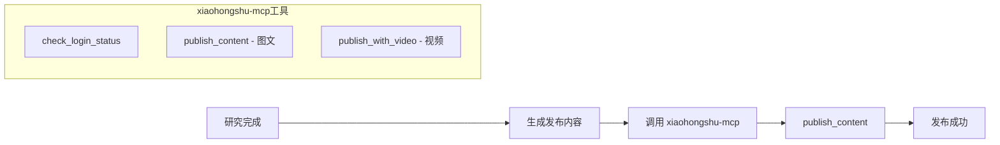
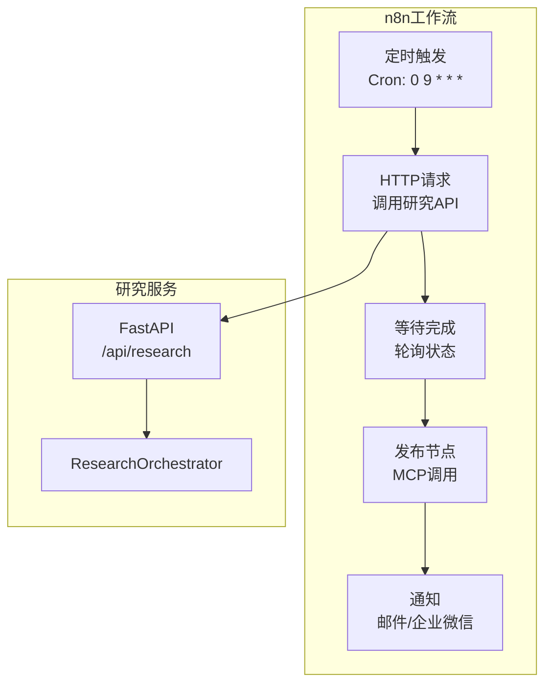
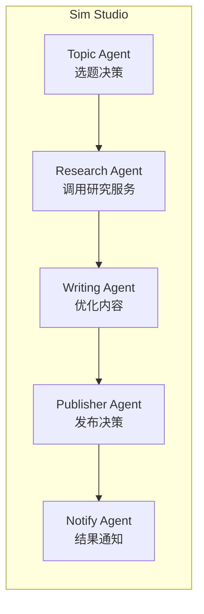
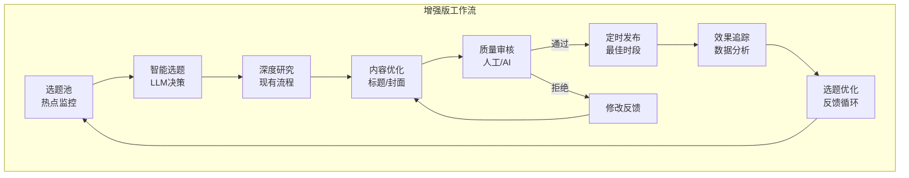
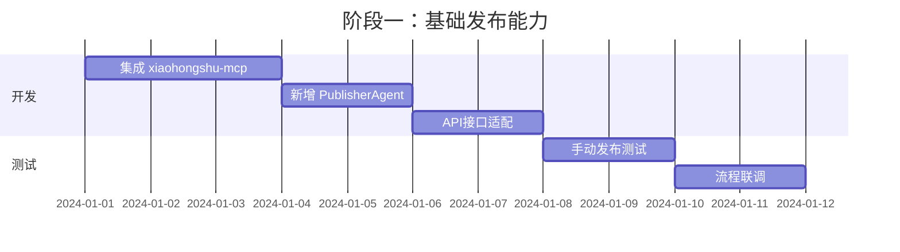

# 小红书深度研究自动发布功能设计文档

## 1. 项目背景与现状分析

### 1.1 当前项目架构

当前 `rednote-research-agent` 项目实现了一个基于 MCP 协议的小红书深度研究智能体，主要流程：


**已实现功能：**
- 🔍 智能搜索：自动拆解研究主题为多个搜索关键词
- 📊 数据分析：提取用户痛点、核心发现和建议
- 📝 报告生成：LLM 驱动的图文交错 HTML 报告
- 🌐 Web 界面：实时 SSE 流式展示研究进度

**缺失功能：**
- ❌ 自动发布到小红书
- ❌ 工作流自动调度与编排
- ❌ 多平台分发

---

## 2. 开源工具生态分析

### 2.1 小红书发布相关工具

根据用户提供的 [Project-RedLoop](https://github.com/stars/nideyongbao/lists/project-redloop) 列表，主要工具如下：

| 工具名称 | 功能定位 | 技术栈 | 推荐指数 |
|---------|---------|-------|---------|
| **[social-auto-upload](https://github.com/dreammis/social-auto-upload)** | 自动化上传视频到社交媒体（抖音、小红书、视频号、TikTok、YouTube、B站） | Python + Playwright | ⭐⭐⭐⭐⭐ |
| **[xiaohongshu-mcp](https://github.com/xpzouying/xiaohongshu-mcp)** | 小红书 MCP 服务器，支持发布图文/视频内容 | Node.js + MCP 协议 | ⭐⭐⭐⭐⭐ |
| **[MediaCrawler](https://github.com/NanmiCoder/MediaCrawler)** | 多平台内容爬虫（小红书、抖音、快手、B站等） | Python + Playwright | ⭐⭐⭐⭐ |
| **[xhs_automate](https://github.com/formero009/xhs_automate)** | 基于AI的小红书内容自动化创作与发布工具 | Python | ⭐⭐⭐ |

#### 工具关系图



### 2.2 工作流编排平台对比

| 平台 | 类型 | 核心特点 | MCP支持 | 适用场景 | 学习曲线 |
|-----|------|---------|---------|---------|---------|
| **[n8n](https://github.com/n8n-io/n8n)** | 通用工作流自动化 | 400+节点、可视化编排、自托管 | ✅ 原生支持 | IT自动化、数据同步、业务流程 | 中等 |
| **[Sim Studio](https://github.com/simstudioai/sim)** | AI Agent工作流构建 | AI Copilot、多模型支持、拖拽式UI | ✅ 原生支持 | AI Agent开发、LLM应用 | 低 |
| **[Dify](https://github.com/langgenius/dify)** | LLM应用开发平台 | RAG、Prompt IDE、可视化编排 | ❌ 需自定义 | 企业级AI应用、知识库问答 | 中等 |
| **[Flowise](https://github.com/FlowiseAI/Flowise)** | LangChain可视化构建器 | 基于LangChain.js、低代码 | ❌ 需自定义 | RAG应用、聊天机器人 | 低 |
| **[LangGraph](https://github.com/langchain-ai/langgraph)** | 图状态机框架 | 高度灵活、复杂工作流 | ❌ 代码级 | 复杂Agent编排、状态管理 | 高 |

#### 平台定位矩阵

|  | 🔧 通用自动化 | 🤖 AI专用 |
|:-:|:-:|:-:|
| **高灵活性** | n8n (代码节点+自定义) | LangGraph (图状态机) |
| **中等** | — | Sim Studio (AI Agent) |
| **低代码** | Zapier类工具 | Dify / Flowise (可视化) |

> **解读**：n8n 偏通用但灵活；LangGraph 最灵活但学习曲线高；Sim Studio/Dify/Flowise 专注AI且易用。

---

## 3. 工具关系与集成架构

### 3.1 整体工具链关系



### 3.2 MCP协议的核心作用

> [!IMPORTANT]
> MCP (Model Context Protocol) 是连接AI模型与外部工具的标准协议，由 Anthropic 于2024年推出。

**MCP在本项目中的价值：**

1. **统一接口层**：无论使用 n8n 还是 Sim Studio，都可以通过 MCP 调用小红书功能
2. **工具解耦**：应用层与平台交互解耦，便于维护和扩展
3. **AI原生**：LLM 可以直接"理解"和调用 MCP 工具



---

## 4. 推荐集成方案

### 4.1 方案一：xiaohongshu-mcp 直接集成（推荐）

> [!TIP]
> 这是最直接、最符合当前项目架构的方案。

**优势：**
- ✅ 与现有 rednote-mcp 架构一致
- ✅ 支持发布图文/视频
- ✅ MCP 协议原生支持
- ✅ 可被 n8n/Sim Studio 直接调用

**实现步骤：**



**代码示例：**

```python
# 新增 publisher.py
from mcp import ClientSession

class PublisherAgent:
    """发布智能体"""
    
    async def publish(self, content: dict, images: list[str]) -> dict:
        """
        发布内容到小红书
        
        Args:
            content: {"title": "...", "description": "..."}
            images: 图片路径列表
        """
        result = await self.mcp_client.call_tool(
            "publish_content",
            arguments={
                "title": content["title"],
                "content": content["description"],
                "images": images  # 本地绝对路径
            }
        )
        return result
```

### 4.2 方案二：n8n 工作流编排

**适用场景：**
- 需要定时调度（每天自动研究并发布）
- 需要多平台分发（小红书 + 抖音 + 微信）
- 需要审批流程（人工审核后发布）

**架构设计：**



**n8n 工作流 JSON 示例：**

```json
{
  "nodes": [
    {
      "name": "定时触发",
      "type": "n8n-nodes-base.scheduleTrigger",
      "parameters": {
        "rule": {"cronExpression": "0 9 * * *"}
      }
    },
    {
      "name": "开始研究",
      "type": "n8n-nodes-base.httpRequest",
      "parameters": {
        "url": "http://localhost:8000/api/research",
        "method": "POST",
        "body": {"topic": "{{ $json.topic }}"}
      }
    },
    {
      "name": "发布到小红书",
      "type": "n8n-nodes-base.mcpClient",
      "parameters": {
        "serverUrl": "http://localhost:5173",
        "tool": "publish_content"
      }
    }
  ]
}
```

### 4.3 方案三：Sim Studio AI Agent 编排

**适用场景：**
- 需要更智能的决策（根据热点自动选题）
- 需要多Agent协作（研究Agent + 写作Agent + 发布Agent）
- 快速原型验证

**Agent 工作流设计：**



---

## 5. 效果优化建议

### 5.1 内容质量优化

| 优化方向 | 具体措施 | 预期效果 |
|---------|---------|---------|
| **标题优化** | 使用爆款标题分析模型 | 提升点击率 30%+ |
| **封面图优化** | VLM评估+自动生成 | 提升曝光率 20%+ |
| **发布时间** | 分析用户活跃时段 | 提升初始曝光 |
| **话题标签** | 自动推荐热门话题 | 增加推荐流量 |

### 5.2 工作流优化



### 5.3 多平台分发

利用 `social-auto-upload` 实现一键多平台分发：

```python
# 多平台发布配置
PLATFORMS = {
    "xiaohongshu": {"enabled": True, "type": "image"},
    "douyin": {"enabled": True, "type": "video"},
    "bilibili": {"enabled": False, "type": "video"},
    "tiktok": {"enabled": False, "type": "video"}
}
```

---

## 6. 推荐实施路径

### 6.1 阶段一：基础发布能力（1-2周）



**交付物：**
- [x] 集成 xiaohongshu-mcp 作为发布服务
- [x] 新增 PublisherAgent 发布智能体
- [x] 研究完成后一键发布功能

### 6.2 阶段二：工作流编排（2-3周）

**交付物：**
- n8n 工作流模板
- 定时研究+发布自动化
- 多平台分发支持

### 6.3 阶段三：智能优化（持续）

**交付物：**
- 爆款标题生成模型
- 发布时间优化策略
- 效果追踪与反馈系统

---

## 7. 关键技术选型建议

| 需求场景 | 推荐工具 | 理由 |
|---------|---------|------|
| **最小改动集成发布** | xiaohongshu-mcp | MCP协议一致，集成成本最低 |
| **定时自动化** | n8n | 成熟的调度能力，可视化管理 |
| **AI驱动决策** | Sim Studio | AI Agent原生支持，快速开发 |
| **企业级应用** | Dify | 知识库+工作流，适合复杂场景 |
| **多平台分发** | social-auto-upload | 支持6+平台，Python生态兼容 |

---

## 8. 总结

### 核心结论

1. **xiaohongshu-mcp 是发布层的最佳选择**：与现有架构一致，MCP协议原生支持
2. **n8n 适合工作流编排**：400+节点、定时调度、可视化管理
3. **Sim Studio 适合AI Agent场景**：拖拽式构建、多模型支持
4. **工具链互补而非替代**：各工具在不同层次发挥作用

### 下一步行动

1. **立即可做**：集成 xiaohongshu-mcp，实现基础发布
2. **短期规划**：引入 n8n 实现定时自动化
3. **中期目标**：建立内容效果追踪与优化闭环
