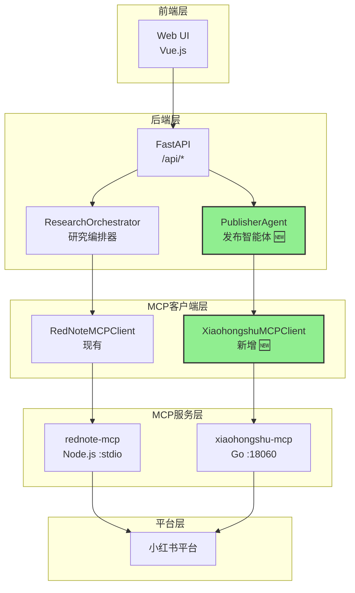
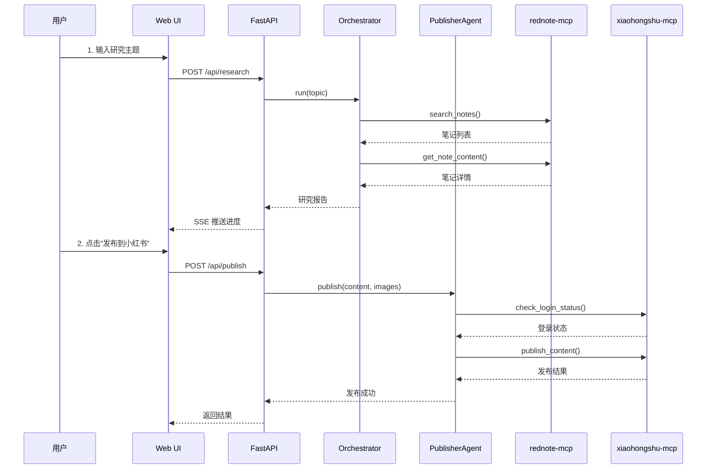

# xiaohongshu-mcp 集成设计文档

## 1. 背景与目标

### 1.1 当前状态

当前项目 `rednote-research-agent` 使用 `rednote-mcp`（Node.js）进行小红书**搜索和获取**：

```
当前架构：
┌─────────────────┐     ┌───────────────┐     ┌─────────────┐
│ ResearchOrchestrator │ --> │ rednote-mcp  │ --> │ 小红书平台  │
│ (搜索/获取)      │     │ (Node.js)     │     │ (只读操作)  │
└─────────────────┘     └───────────────┘     └─────────────┘
```

### 1.2 目标

集成 `xiaohongshu-mcp`（Go语言）实现**发布功能**，形成完整的研究+发布闭环：

```
目标架构：
┌─────────────────┐     ┌───────────────┐     ┌─────────────┐
│ ResearchOrchestrator │ --> │ rednote-mcp  │ --> │ 小红书平台  │
│ (搜索/获取)      │     │ (Node.js)     │     │ (只读操作)  │
└─────────────────┘     └───────────────┘     └─────────────┘
         │
         ↓ 研究完成
┌─────────────────┐     ┌───────────────┐     ┌─────────────┐
│  PublisherAgent  │ --> │xiaohongshu-mcp│ --> │ 小红书平台  │
│ (发布图文/视频)  │     │ (Go, HTTP)    │     │ (写入操作)  │
└─────────────────┘     └───────────────┘     └─────────────┘
```

---

## 2. 两个MCP服务对比

| 特性 | rednote-mcp (当前) | xiaohongshu-mcp (新增) |
|------|-------------------|----------------------|
| **语言** | Node.js + TypeScript | Go |
| **通信方式** | stdio (进程内通信) | HTTP (端口 18060) |
| **主要功能** | 搜索笔记、获取详情、获取评论 | **发布图文/视频**、搜索、点赞、评论 |
| **登录方式** | CLI 命令 (`node dist/cli.js init`) | 独立登录工具 (`xiaohongshu-login`) |
| **Cookie存储** | `~/.mcp/rednote/cookies.json` | `./cookies/` 目录 |
| **适用场景** | 数据采集 | **内容发布** |

### 功能矩阵

| 功能 | rednote-mcp | xiaohongshu-mcp |
|------|:-----------:|:---------------:|
| 搜索笔记 | ✅ | ✅ |
| 获取笔记详情 | ✅ | ✅ |
| 获取评论 | ✅ | ✅ |
| **发布图文** | ❌ | ✅ |
| **发布视频** | ❌ | ✅ |
| 发表评论 | ❌ | ✅ |
| 点赞/收藏 | ❌ | ✅ |
| 获取用户主页 | ❌ | ✅ |

> [!IMPORTANT]
> **设计决策**：保留两个MCP服务，各司其职
> - `rednote-mcp`：继续用于搜索和数据采集（已验证稳定）
> - `xiaohongshu-mcp`：专门用于发布操作

---

## 3. 系统架构设计

### 3.1 整体架构



### 3.2 数据流设计



---

## 4. 详细改动说明

### 4.1 文件改动清单

| 文件路径 | 改动类型 | 说明 |
|---------|---------|------|
| `rednote_research/mcp/xiaohongshu.py` | **[NEW]** | xiaohongshu-mcp HTTP客户端 |
| `rednote_research/agents/publisher.py` | **[NEW]** | 发布智能体 |
| `rednote_research/web/api.py` | **[MODIFY]** | 新增发布API端点 |
| [rednote_research/config.py](file:///e:/code/workspace/1222_2/rednote-research-agent/rednote_research/config.py) | **[MODIFY]** | 新增xiaohongshu-mcp配置 |
| [rednote_research/.env.example](file:///e:/code/workspace/1222_2/rednote-research-agent/rednote_research/.env.example) | **[MODIFY]** | 新增配置示例 |

---

### 4.2 新增文件实现

#### 4.2.1 [NEW] `rednote_research/mcp/xiaohongshu.py`

xiaohongshu-mcp 使用 **HTTP 协议**（不同于 rednote-mcp 的 stdio），需要新建 HTTP 客户端：

```python
"""xiaohongshu-mcp HTTP客户端 - 用于发布功能"""

import httpx
from typing import Optional
from dataclasses import dataclass


@dataclass
class PublishResult:
    """发布结果"""
    success: bool
    message: str
    feed_id: Optional[str] = None


class XiaohongshuMCPClient:
    """
    xiaohongshu-mcp HTTP 客户端
    
    与 RedNoteMCPClient 不同，这个客户端使用 HTTP 而非 stdio，
    因为 xiaohongshu-mcp 是一个独立的 HTTP 服务。
    """
    
    def __init__(self, base_url: str = "http://localhost:18060"):
        """
        初始化客户端
        
        Args:
            base_url: xiaohongshu-mcp 服务地址
        """
        self.base_url = base_url.rstrip("/")
        self.mcp_endpoint = f"{self.base_url}/mcp"
        self._request_id = 0
        self._client: Optional[httpx.AsyncClient] = None
    
    async def connect(self) -> None:
        """建立HTTP客户端连接"""
        if self._client is None:
            self._client = httpx.AsyncClient(timeout=120.0)  # 发布可能较慢
            # 发送 MCP initialize
            await self._send_request("initialize", {
                "protocolVersion": "2024-11-05",
                "capabilities": {},
                "clientInfo": {
                    "name": "rednote-research-publisher",
                    "version": "0.1.0"
                }
            })
    
    async def disconnect(self) -> None:
        """关闭连接"""
        if self._client:
            await self._client.aclose()
            self._client = None
    
    async def _send_request(self, method: str, params: dict) -> dict:
        """发送 MCP JSON-RPC 请求"""
        if not self._client:
            raise RuntimeError("客户端未连接")
        
        self._request_id += 1
        request = {
            "jsonrpc": "2.0",
            "id": self._request_id,
            "method": method,
            "params": params
        }
        
        response = await self._client.post(
            self.mcp_endpoint,
            json=request,
            headers={"Content-Type": "application/json"}
        )
        response.raise_for_status()
        
        result = response.json()
        if "error" in result:
            error = result["error"]
            raise RuntimeError(f"MCP错误: {error.get('message', str(error))}")
        
        return result.get("result", {})
    
    async def call_tool(self, name: str, arguments: dict) -> dict:
        """调用 MCP 工具"""
        response = await self._send_request("tools/call", {
            "name": name,
            "arguments": arguments
        })
        
        # 解析响应内容
        content = response.get("content", [])
        if content and content[0].get("type") == "text":
            import json
            try:
                return json.loads(content[0].get("text", "{}"))
            except json.JSONDecodeError:
                return {"text": content[0].get("text", "")}
        
        return response
    
    # ========== 业务方法 ==========
    
    async def check_login_status(self) -> dict:
        """检查登录状态"""
        return await self.call_tool("check_login_status", {})
    
    async def publish_content(
        self,
        title: str,
        content: str,
        images: list[str],
        tags: Optional[list[str]] = None
    ) -> PublishResult:
        """
        发布图文内容
        
        Args:
            title: 标题（最多20个字）
            content: 正文（最多1000字）
            images: 图片路径列表（本地绝对路径）
            tags: 话题标签（可选）
        
        Returns:
            发布结果
        """
        # 标题限制检查
        if len(title) > 20:
            title = title[:20]
        
        # 正文限制检查
        if len(content) > 1000:
            content = content[:997] + "..."
        
        arguments = {
            "title": title,
            "content": content,
            "images": images
        }
        
        if tags:
            arguments["tags"] = tags
        
        result = await self.call_tool("publish_content", arguments)
        
        return PublishResult(
            success=result.get("success", False),
            message=result.get("message", ""),
            feed_id=result.get("feed_id")
        )
    
    async def publish_video(
        self,
        title: str,
        content: str,
        video: str,
        tags: Optional[list[str]] = None
    ) -> PublishResult:
        """
        发布视频内容
        
        Args:
            title: 标题（最多20个字）
            content: 正文（最多1000字）
            video: 视频文件路径（本地绝对路径）
            tags: 话题标签（可选）
        
        Returns:
            发布结果
        """
        arguments = {
            "title": title[:20] if len(title) > 20 else title,
            "content": content[:1000] if len(content) > 1000 else content,
            "video": video
        }
        
        if tags:
            arguments["tags"] = tags
        
        result = await self.call_tool("publish_with_video", arguments)
        
        return PublishResult(
            success=result.get("success", False),
            message=result.get("message", ""),
            feed_id=result.get("feed_id")
        )
    
    # 上下文管理器支持
    async def __aenter__(self):
        await self.connect()
        return self
    
    async def __aexit__(self, exc_type, exc_val, exc_tb):
        await self.disconnect()
```

---

#### 4.2.2 [NEW] `rednote_research/agents/publisher.py`

```python
"""发布智能体 - 将研究报告发布到小红书"""

from typing import Callable, Optional
from dataclasses import dataclass
from ..mcp.xiaohongshu import XiaohongshuMCPClient, PublishResult


@dataclass
class PublishContent:
    """待发布内容"""
    title: str          # 标题（最多20字）
    content: str        # 正文（最多1000字）
    images: list[str]   # 图片本地路径列表
    tags: list[str]     # 话题标签


class PublisherAgent:
    """
    发布智能体
    
    负责将研究报告内容发布到小红书平台。
    """
    
    def __init__(
        self,
        mcp_client: XiaohongshuMCPClient,
        on_log: Optional[Callable[[str], None]] = None
    ):
        """
        初始化发布智能体
        
        Args:
            mcp_client: xiaohongshu-mcp 客户端
            on_log: 日志回调
        """
        self.mcp_client = mcp_client
        self.on_log = on_log or (lambda x: None)
    
    async def check_ready(self) -> tuple[bool, str]:
        """
        检查发布准备状态
        
        Returns:
            (是否就绪, 状态消息)
        """
        try:
            result = await self.mcp_client.check_login_status()
            is_logged_in = result.get("logged_in", False)
            username = result.get("username", "未知")
            
            if is_logged_in:
                return True, f"已登录账号: {username}"
            else:
                return False, "未登录，请先运行 xiaohongshu-login 登录"
        except Exception as e:
            return False, f"检查登录状态失败: {str(e)}"
    
    async def publish(self, content: PublishContent) -> PublishResult:
        """
        发布内容
        
        Args:
            content: 待发布内容
            
        Returns:
            发布结果
        """
        self.on_log(f"📤 [Publisher] 开始发布: {content.title[:20]}...")
        
        # 验证图片路径
        valid_images = []
        import os
        for img_path in content.images:
            if os.path.exists(img_path):
                valid_images.append(os.path.abspath(img_path))
            else:
                self.on_log(f"⚠️ [Publisher] 图片不存在，跳过: {img_path}")
        
        if not valid_images:
            return PublishResult(
                success=False,
                message="没有有效的图片可发布"
            )
        
        self.on_log(f"📷 [Publisher] 准备上传 {len(valid_images)} 张图片")
        
        # 调用发布
        result = await self.mcp_client.publish_content(
            title=content.title,
            content=content.content,
            images=valid_images,
            tags=content.tags
        )
        
        if result.success:
            self.on_log(f"✅ [Publisher] 发布成功!")
        else:
            self.on_log(f"❌ [Publisher] 发布失败: {result.message}")
        
        return result
    
    @staticmethod
    def prepare_from_report(
        topic: str,
        key_findings: list[str],
        summary: str,
        images: list[str],
        max_images: int = 9
    ) -> PublishContent:
        """
        从研究报告准备发布内容
        
        Args:
            topic: 研究主题
            key_findings: 核心发现列表
            summary: 摘要
            images: 图片路径列表
            max_images: 最大图片数量（小红书限制9张）
        
        Returns:
            待发布内容
        """
        # 标题：截取主题前20字
        title = topic[:20] if len(topic) > 20 else topic
        
        # 正文：组合摘要和核心发现
        content_parts = []
        
        if summary:
            content_parts.append(summary[:300])  # 摘要最多300字
        
        if key_findings:
            content_parts.append("\n\n📌 核心发现：")
            for i, finding in enumerate(key_findings[:5], 1):  # 最多5条
                finding_text = finding[:100]  # 每条最多100字
                content_parts.append(f"{i}. {finding_text}")
        
        content_parts.append("\n\n#深度研究 #小红书研究 #AI分析")
        
        content = "\n".join(content_parts)
        
        # 确保不超过1000字
        if len(content) > 1000:
            content = content[:997] + "..."
        
        # 选择图片（最多9张）
        selected_images = images[:max_images]
        
        return PublishContent(
            title=title,
            content=content,
            images=selected_images,
            tags=["深度研究", "AI分析"]
        )
```

---

### 4.3 修改现有文件

#### 4.3.1 [MODIFY] [rednote_research/config.py](file:///e:/code/workspace/1222_2/rednote-research-agent/rednote_research/config.py)

新增 xiaohongshu-mcp 配置：

```python
# 在 Config 类或配置加载中添加：

@dataclass
class XiaohongshuMCPConfig:
    """xiaohongshu-mcp 配置"""
    base_url: str = "http://localhost:18060"
    enabled: bool = True
    
    @classmethod
    def from_env(cls) -> "XiaohongshuMCPConfig":
        return cls(
            base_url=os.getenv("XIAOHONGSHU_MCP_URL", "http://localhost:18060"),
            enabled=os.getenv("XIAOHONGSHU_MCP_ENABLED", "true").lower() == "true"
        )
```

#### 4.3.2 [MODIFY] [.env.example](file:///e:/code/workspace/1222_2/rednote-research-agent/rednote_research/.env.example)

```env
# 现有配置...
OPENAI_API_KEY=your-api-key-here
OPENAI_BASE_URL=https://api-inference.modelscope.cn/v1
OPENAI_MODEL=gpt-4o
REDNOTE_MCP_PATH=rednote-mcp/dist/index.js

# 新增 xiaohongshu-mcp 配置
XIAOHONGSHU_MCP_URL=http://localhost:18060
XIAOHONGSHU_MCP_ENABLED=true
```

#### 4.3.3 [MODIFY] `rednote_research/web/api.py`

新增发布相关 API：

```python
from ..mcp.xiaohongshu import XiaohongshuMCPClient
from ..agents.publisher import PublisherAgent, PublishContent

# 新增发布端点
@router.post("/api/publish")
async def publish_to_xiaohongshu(request: PublishRequest):
    """发布内容到小红书"""
    
    async with XiaohongshuMCPClient(config.xiaohongshu_mcp.base_url) as client:
        publisher = PublisherAgent(client)
        
        # 检查登录状态
        ready, message = await publisher.check_ready()
        if not ready:
            raise HTTPException(status_code=401, detail=message)
        
        # 准备发布内容
        content = PublishContent(
            title=request.title,
            content=request.content,
            images=request.images,
            tags=request.tags or []
        )
        
        # 发布
        result = await publisher.publish(content)
        
        return {
            "success": result.success,
            "message": result.message,
            "feed_id": result.feed_id
        }

@router.get("/api/publish/status")
async def check_publish_status():
    """检查发布功能状态"""
    
    async with XiaohongshuMCPClient(config.xiaohongshu_mcp.base_url) as client:
        ready, message = await PublisherAgent(client).check_ready()
        
        return {
            "ready": ready,
            "message": message
        }
```

---

## 5. 配置与部署

### 5.1 启动 xiaohongshu-mcp 服务

```bash
# 方式一：使用预编译文件（Windows）
cd E:\code\workspace\1222_2\xiaohongshu-mcp

# 1. 首次登录
.\xiaohongshu-login-windows-amd64.exe

# 2. 启动 MCP 服务
.\xiaohongshu-mcp-windows-amd64.exe
# 服务运行在 http://localhost:18060/mcp
```

```bash
# 方式二：从源码运行
cd E:\code\workspace\1222_2\xiaohongshu-mcp

# 1. 登录
go run cmd/login/main.go

# 2. 启动服务
go run .
```

```bash
# 方式三：Docker
cd E:\code\workspace\1222_2\xiaohongshu-mcp\docker
docker compose up -d
```

### 5.2 验证服务

```bash
# 使用 curl 测试
curl -X POST http://localhost:18060/mcp \
  -H "Content-Type: application/json" \
  -d '{"jsonrpc":"2.0","method":"initialize","params":{},"id":1}'

# 使用 MCP Inspector
npx @modelcontextprotocol/inspector
# 连接到 http://localhost:18060/mcp
```

### 5.3 目录结构

```
E:\code\workspace\1222_2\
├── rednote-research-agent/          # 主项目
│   ├── rednote_research/
│   │   ├── mcp/
│   │   │   ├── client.py             # 现有 stdio 客户端
│   │   │   ├── rednote.py            # 现有 rednote-mcp 客户端
│   │   │   └── xiaohongshu.py        # 🆕 xiaohongshu-mcp HTTP 客户端
│   │   ├── agents/
│   │   │   ├── orchestrator.py       # 现有编排器
│   │   │   └── publisher.py          # 🆕 发布智能体
│   │   └── web/
│   │       └── api.py                # 修改：新增发布API
│   └── rednote-mcp/                  # 子模块：搜索/获取
│
└── xiaohongshu-mcp/                  # 🆕 克隆的发布服务
    ├── xiaohongshu-mcp-windows-amd64.exe
    ├── xiaohongshu-login-windows-amd64.exe
    └── cookies/                      # Cookie 存储
```

---

## 6. 实施计划

### 阶段一：基础集成（1-2天）

- [ ] 创建 `mcp/xiaohongshu.py` HTTP 客户端
- [ ] 创建 `agents/publisher.py` 发布智能体
- [ ] 更新配置文件，支持 xiaohongshu-mcp URL
- [ ] 启动 xiaohongshu-mcp 服务并验证连接

### 阶段二：API 集成（1天）

- [ ] 新增 `/api/publish` 发布端点
- [ ] 新增 `/api/publish/status` 状态检查端点
- [ ] 测试发布流程

### 阶段三：前端集成（1-2天）

- [ ] 在报告预览页面添加"发布到小红书"按钮
- [ ] 添加发布状态提示和进度显示
- [ ] 添加发布结果反馈

### 阶段四：优化与测试（2-3天）

- [ ] 标题/正文自动优化（长度限制、爆款标题）
- [ ] 图片自动筛选与压缩
- [ ] 端到端测试

---

## 7. 注意事项

> [!CAUTION]
> **重要风险提示**

1. **Cookie 冲突**：xiaohongshu-mcp 和 rednote-mcp 使用不同的 Cookie 存储，可能需要分别登录
2. **账号登录限制**：小红书同一账号不允许在多个网页端登录，登录 xiaohongshu-mcp 后不要在其他浏览器登录
3. **发帖频率限制**：每日发帖上限约 50 篇，避免触发风控
4. **标题长度**：必须 ≤ 20 字
5. **正文长度**：必须 ≤ 1000 字
6. **图片要求**：
   - 推荐使用本地绝对路径
   - 路径中避免中文字符
   - 单次最多 9 张图片

> [!TIP]
> **调试建议**

- 使用 `xiaohongshu-mcp -headless=false` 启动非无头模式，可以看到浏览器操作
- 首次发布建议手动验证，确认账号无风控限制
